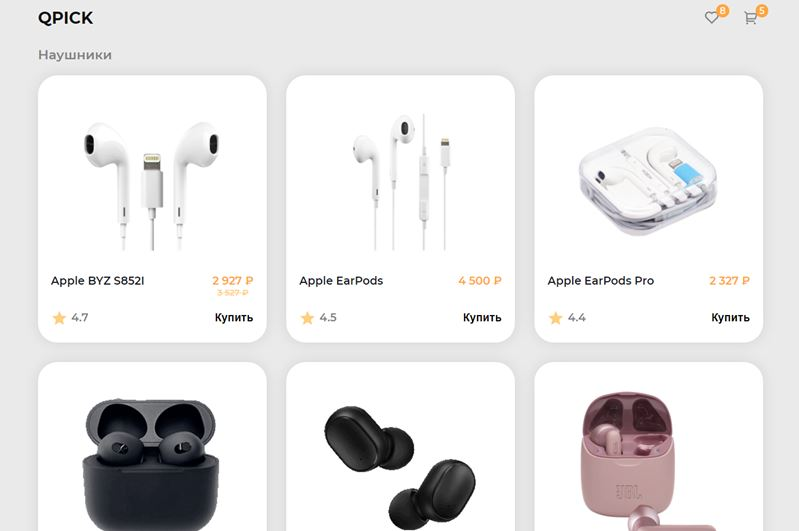

# Корзина покупок

## [Demo](https://devmikealex.github.io/Shopping-cart/)

Проект "**Корзина покупок**" представляет из себя две страницы интернет-магазина аудио аксессуаров. Первая страница - каталог товаров, вторая - корзина с покупками. Прочие ссылки ведут на несуществующие ресурсы.

## Технологии проекта

- JavaScript
- HTML
- CSS

## Описание и особенности

- Данные о каждом товаре хранятся в виде элементов массива
- Для передачи информации между страницами используется **localStorage**
