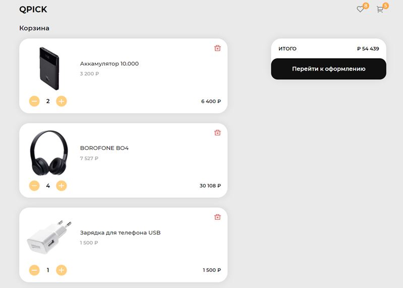

# Корзина покупок

## [Demo](https://devmikealex.github.io/Shopping-cart/)

Проект "**Корзина покупок**" представляет из себя две страницы интернет-магазина аудио аксессуаров. Первая страница - каталог товаров, вторая - корзина с покупками. Прочие ссылки ведут на несуществующие ресурсы.

Кнопка "**Купить**" у товара, добавляет его в корзину только один раз. Счетчик разновидностей товара, добавленного в корзину, расположен в правом верхнем углу. Он же является ссылкой на открытие полного списка корзины.

В этом списке можно изменить количество заказываемых товаров или полностью удалить элемент. Общая цена и итоговая цена обновляются соответственно.

## Технологии проекта

- JavaScript
- HTML
- CSS

## Описание и особенности

- Данные о каждом товаре хранятся в виде элементов массива
- Для передачи информации между страницами используется хранилище браузера **localStorage**
